# Expense Tracker

A React Native + Expo expense tracking app with local authentication, transaction logging, date-range analytics, and profile management.

## Setup Instructions

### Prerequisites

- Node.js 18+
- npm 9+
- Expo CLI (optional, `npx expo` is enough)
- Android Studio emulator or Expo Go on a real device

### Installation

```bash
npm install
```

### Run the app

```bash
npm run dev
```

Then choose a target from the Expo terminal:

- `a` for Android emulator
- `w` for web
- Scan QR with Expo Go for physical device testing

## Feature List

- Sign up and sign in flow with local SQLite-backed auth
- Light/dark theme toggle
- Add income and expense transactions
- Preset and custom categories
- Date picker based transaction entry
- Dashboard with date-range filtering
- Income, expense, and balance summary cards
- Expense breakdown chart by category
- Transaction list with delete action
- Profile screen with editable name/email/password and sign out

## Screenshots of App Screens

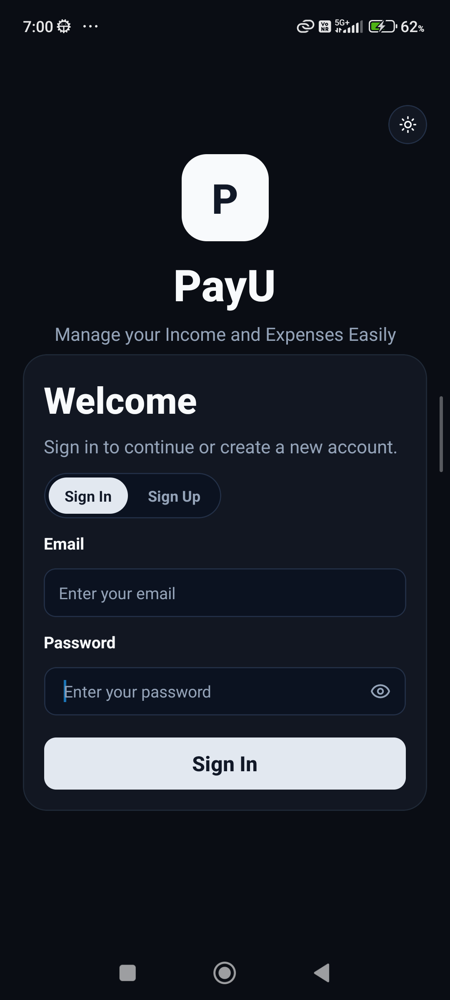
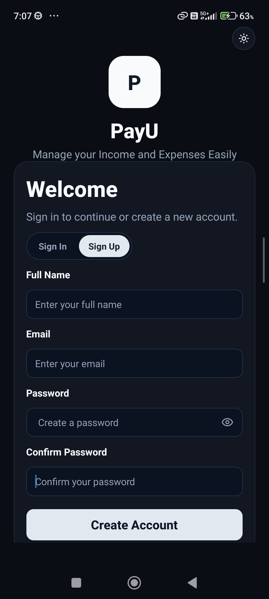
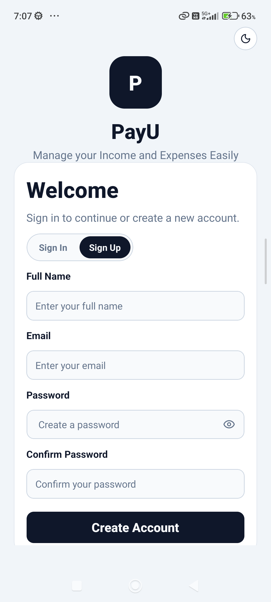
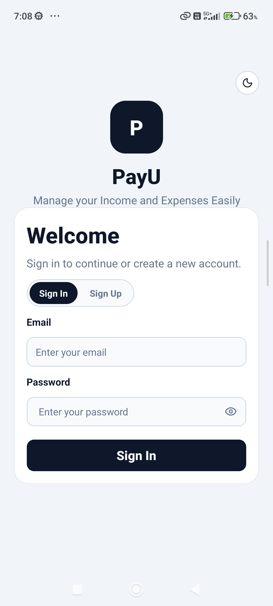
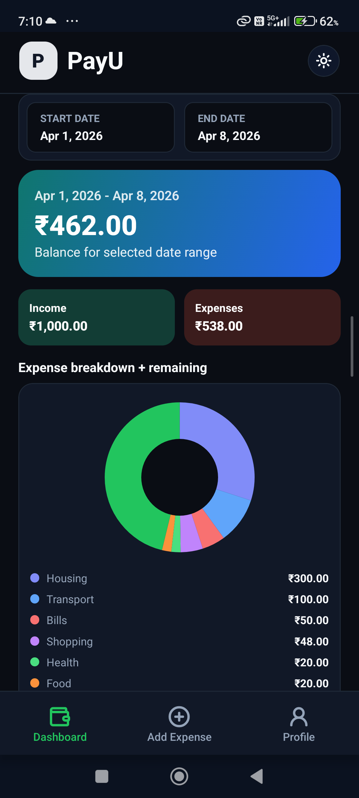
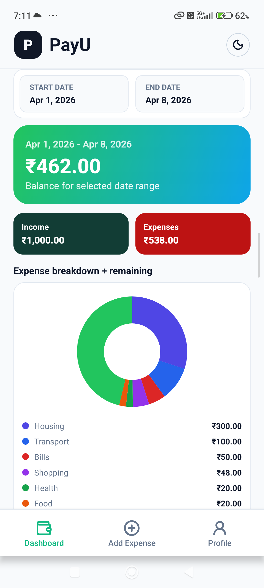
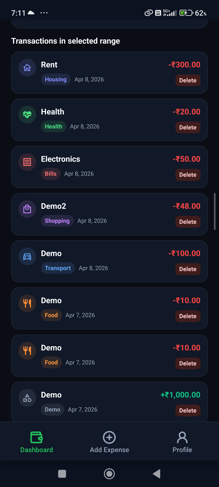
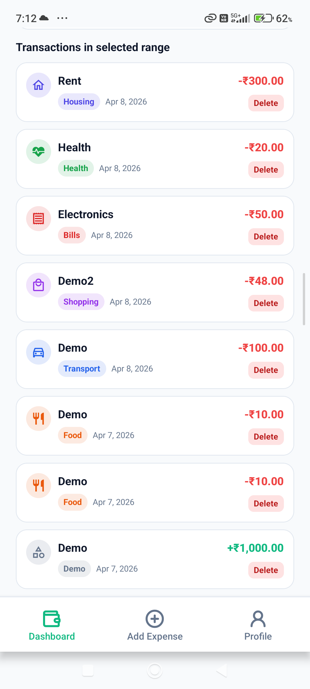
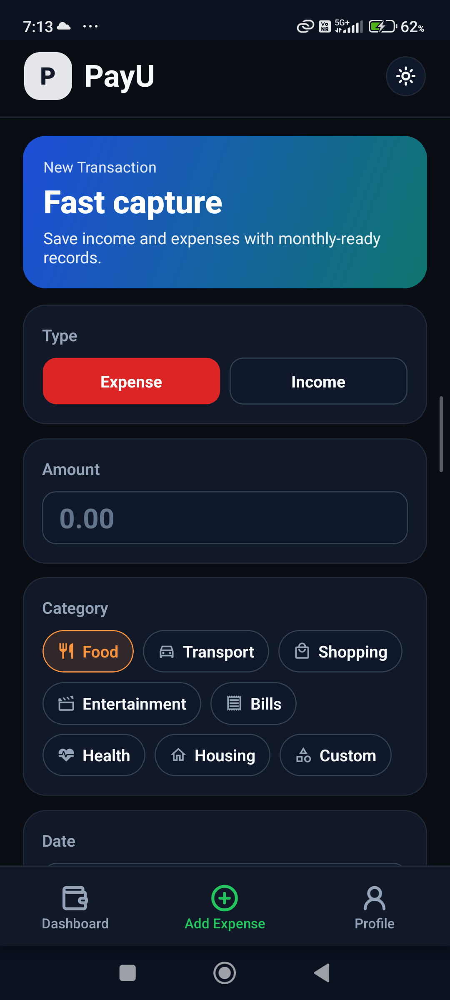
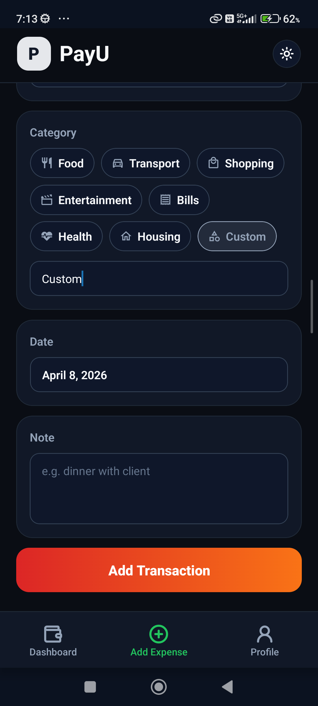
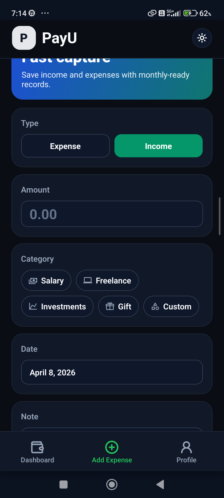
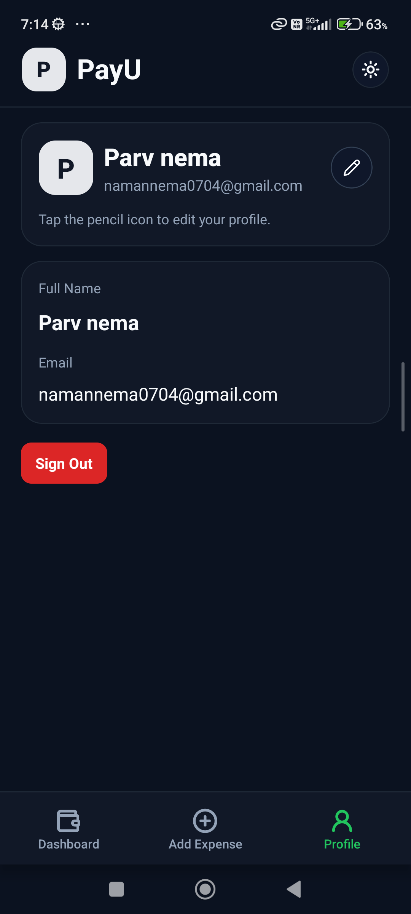
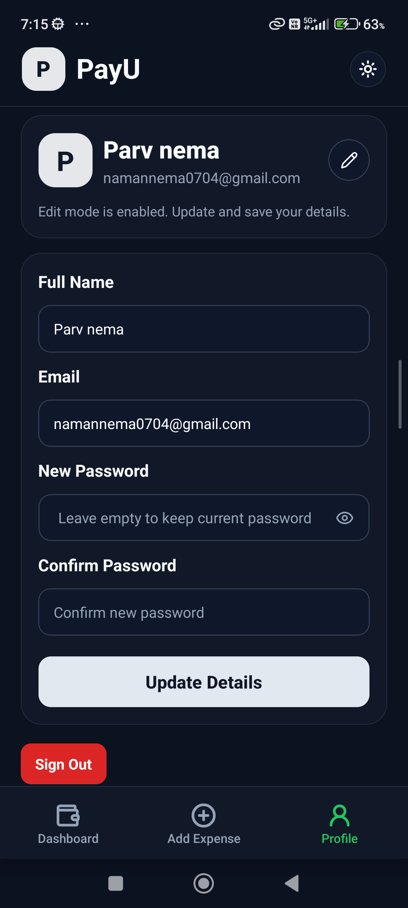
